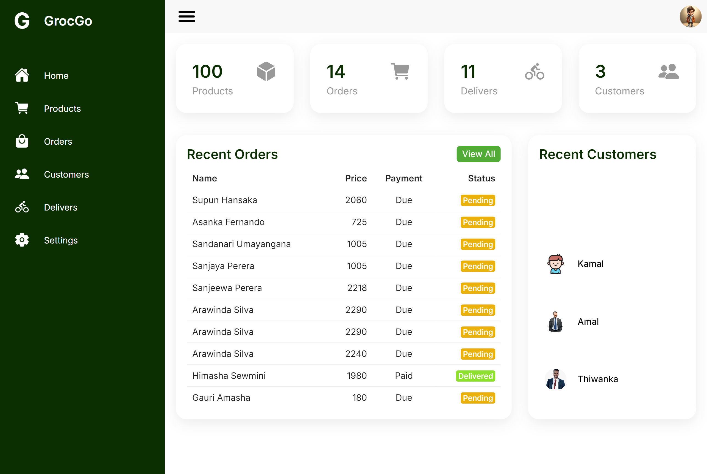

# GrocGo

GrocGo is a cutting-edge supermarket delivery platform designed to revolutionize your grocery shopping experience. Our platform provides a seamless and user-friendly interface for customers, an efficient management system for supermarket admins, and essential tools for deliverers to ensure timely and reliable service.


## Features

### Ecommerce Web

- **Customer Login and Signup**: Secure access and easy registration.
- **Cart Management**: Products added to cart saved in local storage.
- **Checkout Access**: Secure transactions for logged-in customers.
- **Product Categories and Services**: Comprehensive catalog and service listings.
- **Price Range Filtering**: Customizable search based on price range.
- **Product Search Facility**: Efficient search for quick product discovery.
- **Outlet Pickup and Delivery Options**: Flexible choices for customers.
- **Automatic Delivery Assignment**: Efficient allocation of deliverers.
- **Branch Location Maps**: Visual guidance for branch locations and coverage areas.
- **Order Notifications**: Real-time updates via email.
- **PDF Receipts**: Detailed records of purchases sent via email.

### Admin Panel

- **Admin Login**: Secure access for authorized personnel.
- **Product Management**: View, add, update, delete products.
- **Order Management**: Update and delete orders.
- **Customer Data Management**: Access and manage customer information.
- **Deliverer Details Management**: View and manage deliverer assignments and availability.
- **Admin Account Management**: Update and delete admin accounts.
- **Admin Registration**: Controlled access for registering new admins.

### Delivery Dashboard

- **Deliverer Login and Signup**: Easy access with email verification.
- **Order Viewing**: Real-time access to new orders.
- **Availability Status**: Manage availability for efficient scheduling.
- **Order Details**: Comprehensive information for accurate delivery.
- **Earnings Tracking**: Financial monitoring with charts.
- **Profile Management**: Update profile, change password, and manage account.

## Project Outcomes

- **Enhanced Customer Experience**: User-friendly interface and convenient shopping options.
- **Streamlined Admin Management**: Efficient product and order handling, comprehensive customer data.
- **Optimized Delivery Operations**: Effective delivery management, transparent earnings tracking, improved coordination.

## Future Enhancements

- **Real-Time Delivery Tracking**: Live tracking for greater transparency.
- **Hub for All Supermarkets**: Integration of multiple supermarkets for expanded reach.
- **AI-Based Product Suggestions**: Personalized recommendations based on customer preferences.
- **Expanded Payment Options**: Diverse payment methods for secure and efficient transactions.

## Screenshots

### Customer Interface


### Admin Panel


### Delivery Dashboard


## Installation

To get started with GrocGo, follow these steps:

1. **Clone the Repository**:
   ```sh
   git clone https://github.com/ThiwankaImalshan/GroceGo.git

## Credit and Owner : Thiwanka Imalshan
